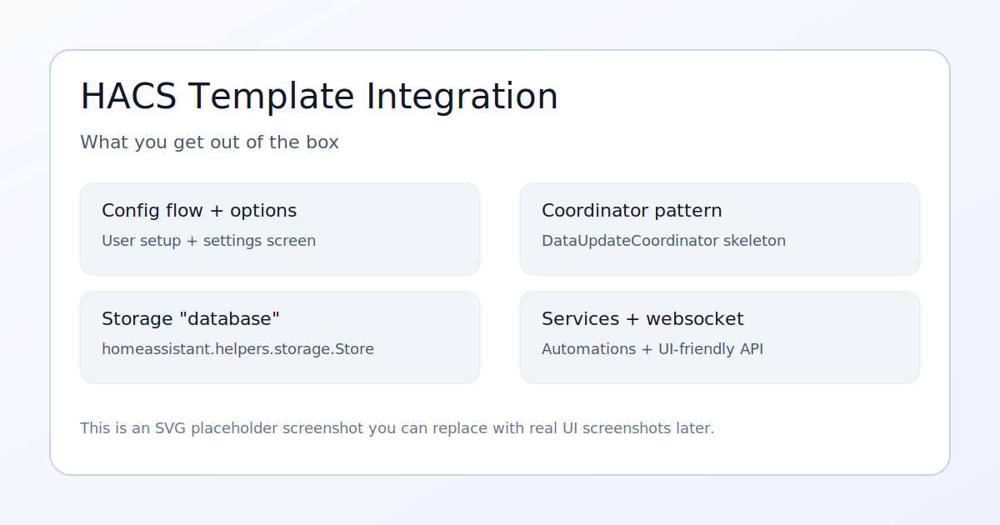
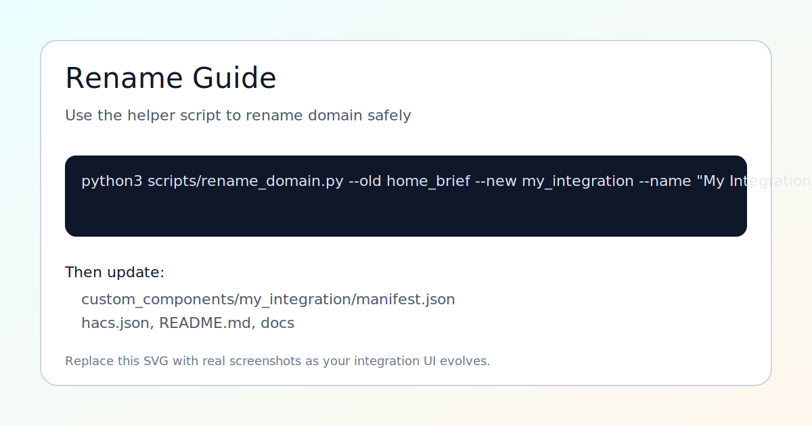

# Home Assistant HACS Integration Template

Opinionated, production-ready template for a HACS-installable Home Assistant custom integration.

Includes:
- `custom_components/hacs_template/` integration skeleton (config flow, coordinator, storage, services, websocket, sensor)
- HACS metadata (`hacs.json`) + icons/logos
- GitHub Actions validation (HACS + hassfest)
- Docs + example screenshots (SVG)

## Quick Start (Use This Repo As A Template)

1. Create a new repo from this template (GitHub "Use this template").
2. Pick your domain, e.g. `my_integration` (lowercase, underscore).
3. Run the rename helper:

```bash
python3 scripts/rename_domain.py --old hacs_template --new my_integration --name "My Integration"
```

4. Review and adjust:
- `custom_components/<domain>/manifest.json`
- `custom_components/<domain>/const.py`
- `custom_components/<domain>/config_flow.py`
- `hacs.json`
- `README.md`

5. Add repo to HACS as a custom repository (category `Integration`), install, restart Home Assistant, then add integration via Settings.

## What You Get

- A config flow with basic options.
- A simple `DataUpdateCoordinator` + example sensor.
- A persistent store (`homeassistant.helpers.storage.Store`) you can use as your "database".
- Example services + websocket command patterns.

## Screenshots




## Notes

- Icons in the repo root (`icon.png`, `logo.png`, `dark_*`) are for HACS/repo branding.
- The integration folder also contains its own `icon.png` / `logo.png` for UI compatibility.
- If your Git credentials/token cannot push workflow files, the workflow lives in `docs/workflows/validate.yml`.
  Enable it by running:

```bash
./scripts/enable_ci.sh
```
