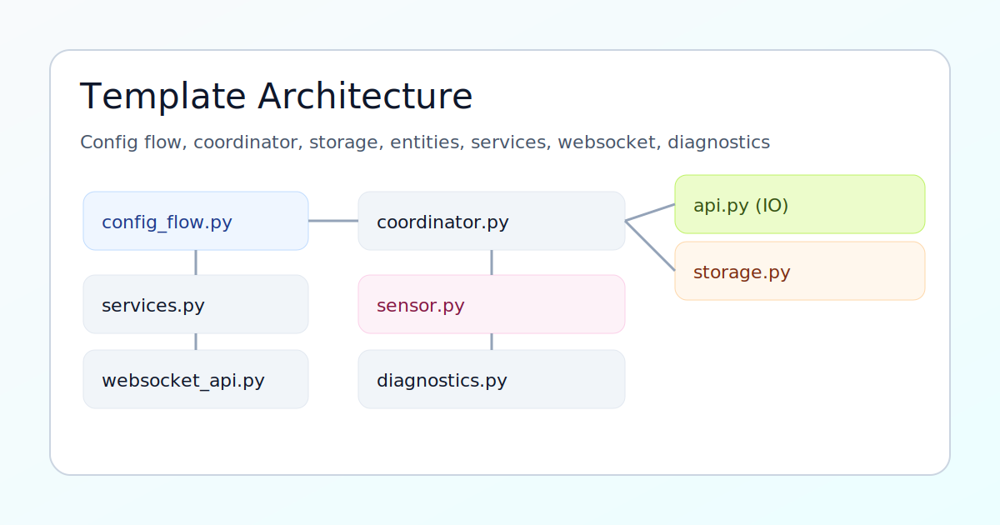
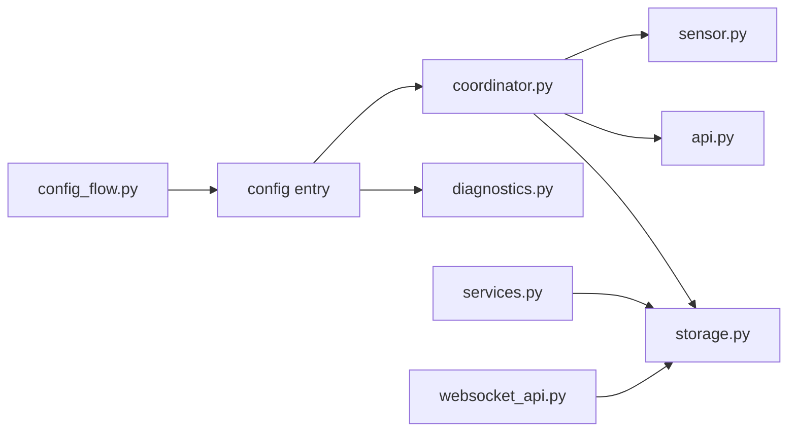

# Home Assistant HACS Integration Template

Opinionated, production-ready template for a HACS-installable Home Assistant custom integration.


## What You Get

- Config flow + options flow (with a realistic reauth example)
- Coordinator pattern (`DataUpdateCoordinator`) with auth-failure mapping (`ConfigEntryAuthFailed`)
- Storage "database" (`homeassistant.helpers.storage.Store`) with schema migrations
- Diagnostics (redacted secrets)
- Services (response services) + websocket command example
- DeviceInfo helper for consistent device/entity metadata
- Release kit (version bump script + tag release workflow template)
- Local validation script + optional Ruff lint
- Devcontainer (Codespaces/VS Code) for fast onboarding
- GitHub templates (issues/PR), Dependabot config
- Icons/logos in repo root and in `custom_components/<domain>/`

## Architecture (Visual)





## Quick Start

1. Create a new repo from this template (GitHub: "Use this template").
2. Choose your integration domain, e.g. `my_integration` (lowercase, underscore).
3. Rename the template:

```bash
python3 scripts/rename_domain.py --old hacs_template --new my_integration --name "My Integration" --repo yourname/my_integration --codeowner "@yourhandle"
```

4. Update URLs + ownership in `custom_components/<domain>/manifest.json` and `hacs.json`.
5. Add repo in HACS (Custom repositories, category `Integration`), install, restart Home Assistant, add integration in Settings.

## Repo Layout

```text
custom_components/hacs_template/   Integration code (rename this folder)
docs/                             Extra documentation + workflow templates
scripts/                          Validation, rename, release helpers
hacs.json                          HACS metadata
icon.png / logo.png                Repo branding (HACS)
custom_components/.../icon.png      Integration branding (HA UI)
```

## Local Development

Optional dependencies:

```bash
pip3 install -r requirements-dev.txt
```

Run checks:

```bash
./scripts/validate.sh
```

## GitHub Actions Workflows

Some Git credentials/tokens cannot push workflow files under `.github/workflows/` (needs `workflow` scope).
This repo stores workflow templates in `docs/workflows/`.

Enable workflows locally by copying them into place:

```bash
./scripts/enable_ci.sh
```

## Release Flow

1. Bump manifest version + tag:

```bash
./scripts/release.sh 0.1.1
git push
git push --tags
```

2. If you enabled `docs/workflows/release.yml`, GitHub will create a release from the tag.

## Screenshots


## Notes

- Remove host/api_key and reauth if your integration does not need auth.
- Frontend stub is included but disabled by default. To ship a built card/panel JS artifact, set `ENABLE_FRONTEND=True` in `custom_components/<domain>/const.py` and replace `frontend/hacs-template-card.js`.
- This template intentionally uses HA-native patterns so contributors see "the Home Assistant way" immediately.
