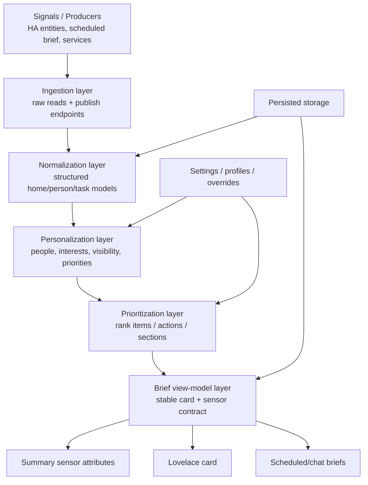

# Home Brief Rework Foundation

## Why this rework exists

Home Brief started as a useful heuristic summary card.
That was enough to prove value, but it is not enough to support the next phase.

The current system still mixes too many responsibilities together:

- live signal ingestion
- fallback discovery
- brief generation
- person-specific reasoning
- UI rendering
- scheduled morning-brief publishing
- future settings / customization

That is workable for a prototype.
It is the wrong foundation for a personalized product.

The rework should turn Home Brief from **"smart status card"** into a **personalized household briefing system**.

---

## Product direction

Home Brief should become the layer that answers:

- What matters in this home right now?
- What matters to this person right now?
- What should happen next?
- Why is this being shown?
- How can the household tune what counts as important?

That means the product needs stronger first-class support for:

- structured ingestion
- persisted briefing state
- person-aware filtering
- interest/category preferences
- explicit visibility rules
- configurable prioritization
- stable rendering contracts

Not a pile of ad hoc attributes.
A real model.

---

## Core design principles

### 1. Stable data beats opportunistic recompute
Generated brief payloads should be published into Home Brief and stored.
The UI should primarily render from stored normalized state, not from ad hoc runtime recomputation paths.

### 2. Personalization is a core layer, not a post-processing hack
The system should understand people explicitly.
Not just "Nikolaj special-casing" scattered through the coordinator.

### 3. Settings should describe behavior, not just entities
Users should be able to tune:

- who the brief is for
- which categories matter
- which sources are visible
- how strong different priorities are
- whether to show household vs personal vs ambient signals
- whether scheduled briefs publish / notify / both

### 4. Rendering should consume contracts, not invent logic
The card should render normalized data from a stable view model.
Business logic should live upstream.

### 5. Every important layer should be inspectable
If Home Brief decides to show something, users should be able to inspect:

- source
- mode (explicit/autofilled/published)
- score / rank
- reason
- target person
- freshness

---

## Target architecture



---

## New internal layers

## Layer 1 — ingestion

### Responsibilities
- read configured/discovered Home Assistant entities
- accept externally published structured payloads
- record freshness and source mode

### Inputs
- entity states
- `home_brief.publish_morning_brief`
- future publish services for settings/profiles or other brief segments

### Output
A raw ingestion bundle with timestamps and source provenance.

---

## Layer 2 — normalization

### Responsibilities
Convert raw source shapes into stable internal objects.

### Needed normalized models

#### PersonProfile
```json
{
  "id": "nikolaj",
  "name": "Nikolaj",
  "aliases": ["nikolaj"],
  "interests": ["energy", "chores", "weather"],
  "focus_mode": "balanced",
  "show_household": true,
  "show_personal": true,
  "show_ambient": true
}
```

#### BriefItem
```json
{
  "id": "waste-paper-today",
  "kind": "waste",
  "title": "Paper pickup is today",
  "summary": "Take the paper bin out before collection.",
  "score": 91,
  "reason": "waste_today",
  "time_window": "today",
  "people": ["household"],
  "source": {
    "mode": "entity",
    "entity_id": "sensor.affald_pap"
  }
}
```

#### ChoreItem
Already partly exists, but should become a stable model used across:
- card rendering
- personalization
- scheduled brief generation
- settings rules

#### MorningBriefPayload
Should remain publishable, but normalized into stable sections:
- summary
- top priorities
- weather context
- energy context
- personal tasks
- household tasks
- metadata/freshness

---

## Layer 3 — personalization

### Responsibilities
Take normalized home data and decide what matters to a given person.

### Examples
- Nikolaj cares about his tasks first
- another household member may care about weather + errands but not power pricing
- some people want more ambient context, others want only next actions

### Required settings surface
At minimum:
- enabled people / profiles
- preferred categories
- hidden categories
- focus mode (`ruthless`, `balanced`, `ambient`)
- personal-vs-household weighting
- weather visibility
- energy visibility
- source debugging visibility

This layer should replace hardcoded "Nikolaj" assumptions over time.

---

## Layer 4 — prioritization

### Responsibilities
Rank sections and items.

### Priority classes
- personal task
- household task
- waste
- energy
- weather
- comfort
- away/setup
- scheduled brief imported priorities

### Ranking factors
- urgency
- time sensitivity
- personal relevance
- confidence
- actionability
- freshness
- duplication / overlap suppression

This is where:
- `top_action`
- `recommended_actions`
- `next_up`
- section order
- card density

should be determined.

---

## Layer 5 — view model

### Responsibilities
Produce a stable contract for:
- summary sensor
- Lovelace card
- daily brief/chat surfaces

### Goal
The frontend should not need to guess:
- what comes first
- what is primary vs secondary
- whether a personal task outranks household waste

That should already be decided.

### Candidate output groups
- `hero`
- `morning_brief`
- `next_up`
- `personal_focus`
- `household_focus`
- `energy_focus`
- `slot_pressure`
- `recommended_actions`
- `debug/source_context`

---

## Settings expansion strategy

The settings rework should not start by dumping dozens of config fields into the existing flow.
That would be lazy and ugly.

### Phase 1 settings
Build a small but real settings model around behavior:

- brief audience / active person
- focus mode
- category visibility toggles
- show/hide household context
- show/hide debugging/source mapping
- scheduled brief publish enabled

### Phase 2 settings
- multiple person profiles
- per-person category weighting
- section ordering / density preferences
- source pinning vs auto mode clarity
- notification/publish policy

### Phase 3 settings
- custom routines
- time-of-day behavior
- leave-home mode
- task bundle suggestions
- per-person morning brief styles

---

## Migration strategy

This should be incremental, not big-bang.

### Track A — foundation
- persisted brief publish path
- normalized stored payload shape
- source/freshness metadata
- architecture docs

### Track B — people + preferences
- person profile model in storage
- default profile seeded from current setup
- soft migration from hardcoded `nikolaj_chores`

### Track C — view-model contracts
- move ranking logic into a view model builder
- card consumes stable sections instead of ad hoc attributes

### Track D — settings UI
- add settings surface for behavior/preferences
- avoid dumping everything into initial config flow if a dedicated options model is cleaner

### Track E — full personalization
- multiple profiles
- per-person brief surfaces
- category/interest filtering

---

## Immediate implementation slices

## Slice R1 — rework spec + roadmap
This document.

## Slice R2 — persisted producer path
Move scheduled brief runtime to publish into Home Brief as the default path.

## Slice R3 — normalized morning brief metadata
Introduce a more explicit normalized structure for published payload metadata/freshness.

## Slice R4 — person profile storage
Add profile storage with a seeded default profile for Nikolaj.

## Slice R5 — preference model
Add basic category visibility and focus mode settings.

## Slice R6 — view-model builder
Move card-facing prioritization into a dedicated transformation step.

## Slice R7 — settings surface v1
Expose profile + focus + category controls.

## Slice R8 — UI rebuild on top of view model
Redesign card sections around personal focus, household context, and controllable density.

---

## What success looks like

Home Brief should feel like:

- personal
- clear
- inspectable
- configurable without turning into enterprise sludge
- useful in under 20 seconds
- robust enough that scheduled and card experiences use the same underlying truth

And most importantly:

It should stop feeling like a clever widget and start feeling like an actual household operating layer.
